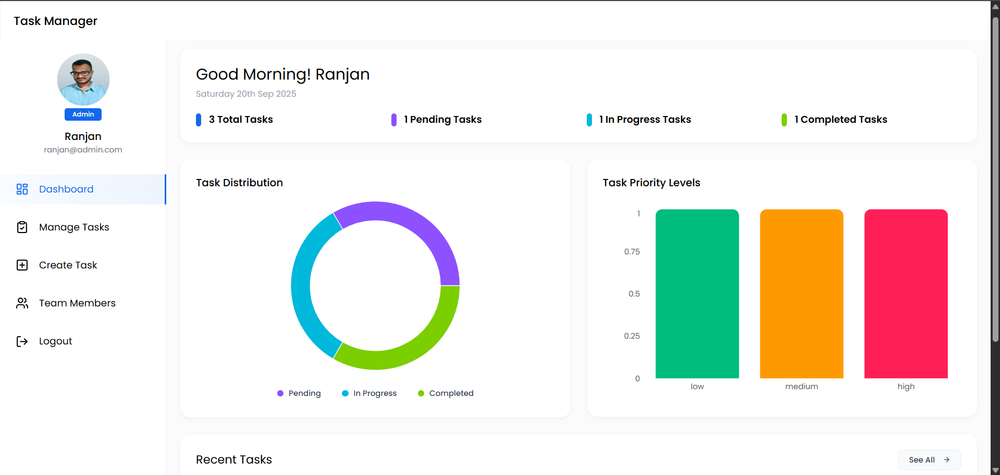

🚀 Task Manager - Smart Productivity Dashboard

A full-stack MERN application designed to simplify team collaboration and task tracking.
Task Manager provides a modern dashboard with real-time updates, charts, and role-based access to help individuals and teams boost productivity and clarity.

🌐 Live Demo → https://task-manager-ua1x.vercel.app/

✨ Features

📋 Task Management – Create, assign, update, and track tasks.

👥 Team Collaboration – Role-based access for admins and members.

📊 Task Distribution Charts – Visual insights with Charts.js.

🚦 Priority Insights – Manage tasks based on priority levels.

⚡ Real-Time Updates – Seamless task synchronization across the team.

🎨 Clean Dashboard UI – Intuitive and modern interface.

🛠️ Tech Stack

Frontend: React.js, Charts.js, Tailwind CSS
Backend: Node.js, Express.js
Database: MongoDB (Mongoose ODM)
Hosting: Vercel

📸 Screenshots

⚙️ Installation & Setup

Clone the repository:

git clone https://github.com/ranjan-sw-developer/task-manager
cd task-manager

🔹 Backend Setup
cd backend
npm install

Create a .env file in server/ with the following:

MONGO_URI=your_mongodb_connection_string
PORT=8000
JWT_SECRET=your_secret_key
ADMIN_INVITE_TOKEN=invite_token

Run backend server:

npm run dev

🔹 Frontend Setup
cd frontend/Task-Manager
npm install

Run frontend:

npm run dev

The app will be available at http://localhost:3000
🚀

📊 Dashboard Highlights

Task distribution by priority and status.

Visual progress tracking using Charts.js.

Real-time task updates with role-based permissions.

🔥 Built with ❤️ using the MERN Stack
